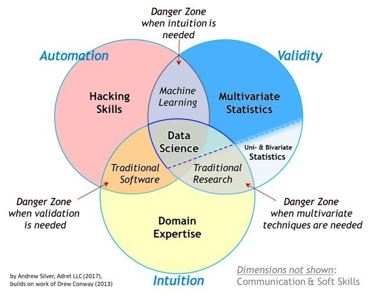
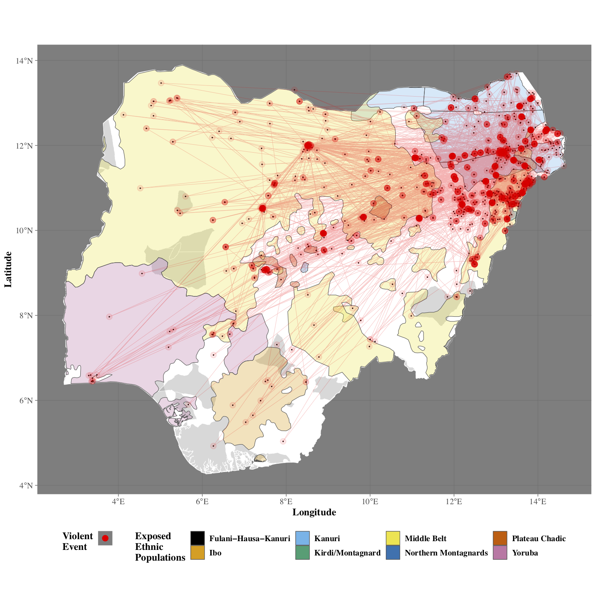
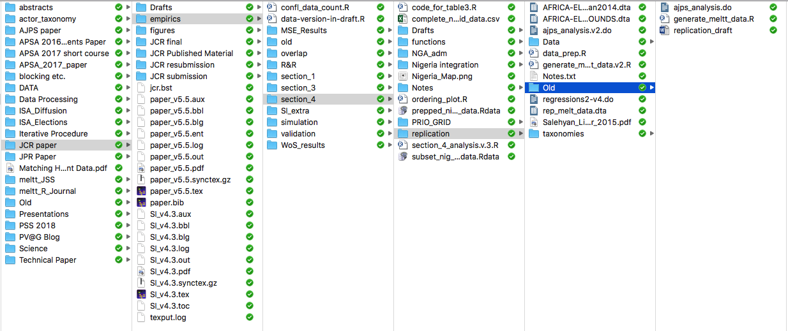

```{r setup, include=FALSE}
knitr::opts_chunk$set(echo = T,message=F,error=F,warning = F)
require(tidyverse)
require(here)
require(kableExtra)
```

layout: true

<div class="slide-footer"><span> 
PPOL564 | Data Science I - Foundations

&emsp;&emsp;&emsp;&emsp;&emsp;&emsp;&emsp;&emsp;&emsp;

Class 1 <!-- Week of the Footer Here -->

&emsp;&emsp;&emsp;&emsp;&emsp;&emsp;&emsp;&emsp;&emsp;&emsp;&emsp;&emsp;

Work Flow and Reproducibility<!-- Title of the lecture here -->

</span></div> 


---

class: outline

# Plan for Today

- **Introduce the Course**
  - Chat about data science
  - Aims of the course
  - Schedule
  - Other important information

- **Reproducibility** 
  
    + what it means
    + how reproducible practices might save your life
    + how to build code that you and others can replicate and read

---

<br><br><br><br><br><br>
# What is data science?

---

<br>
.center[]

---

## The Aim of Data Science 

### Generate

  + **Valid**  
      + <span style="color:#477acc"> scrutiny, discussion & limitations <span>
  + **Unbiased**
      + <span style="color:#477acc"> introspection, diversity & substantive knowledge <span>
  + **Repoducible** 
      + <span style="color:#477acc"> data provenance, code transparency & version control <span>
  + **Compelling** 
      + <span style="color:#477acc"> interpretable, intuitive & clear <span>
  
### insights using data to _influence and inform decision-making_.

---


## This Course focuses on

- Developing **programmatic methods and tools** in python. 
  - Understanding data types and programming approaches.
  - Developing a data wrangling toolkit.
  - Becoming versed in scientific computing: converting math to code, leveraging code to understand math. 
  - Best Practices
      + clean, well-documented, and readable code
      + version control 
  
- Understanding the **mathematical components** that underpin data analytic and statistical learning approaches. 
  - Linear algebra &rarr; linear regression & data decomposition.
  - Multivariate calculus &rarr; computational optimization
  - Probability &rarr; simulation and sampling

---

## What this course is not?

<br>
<br>

- A full CS course on object-oriented programming.

- Webscraping or data retrieval (DSII)

- A machine learning course (we dabble with important computational concepts, but don't delve into implementation. No fitting data or prediction). (DSII)

- A "big data" course (we won't delve into database structures, such as SQL). (Massive Data & Databases Elective)

---

## Course Calendar

<br>

```{r,echo=F,message=F,tidy=T}
d = 
  read_csv(here('Syllabus/fall-2019-timeline.csv')) %>% 
  {.[is.na(.)]="";.} %>% 
  select(Date,Topic) %>% 
  slice(-31) %>% 
  filter(Topic!="No Class") %>% 
  rename(Topics=Topic)

bind_cols(d[1:13,],d[14:26,]) %>% 
  rename(Date=Date1,Topics=Topics1) %>% 
  kable(., "html") %>% 
  kable_styling(font_size = 16,position = 'center')
```

---

## Everything else

- Class Website: http://ericdunford.com/ppol564/

- Readings:
  
  - Reading list posted on website for class each day. 
  - Most readings open source (can access via link)
  - Some readings are in hardcopy and will be posted on CANVAS.
  
- Class Slack Chanel for Communication 
  
  - Use it publically or privately to coordinate and work through issues
  
- Recitation
  
  - Mondays from 5 to 5:50 in Car Bar 203. 
  
- Class on Sept. 23rd will be during recitation. 


---


class: newsection

# Reproducibility <br> as a <br> _Practical_ Reality

---

## We focus on things like this...

<!--  -->

.center[]

---

## And forget the reality that is this... 

.center[]


---

## Reproducibility with a captial "R"

**...is fundamental to the scientific method, but it is also a <u> practical reality </u>.**

<br>

- juggling multiple versions of the same file

- collaboration can create conflicts across versions

- projects are picked up and put down &rarr; tracing the progression of a project across a spiderweb of files is not always easy (or possible)

- new people enter the fray &rarr; getting them up-to-speed means walking them through the labyrinth, which wastes time and resources.

---

# Generating Reproducible Work

<br>
### 1. Readable

### 2. Portable

### 3. Well-Named

### 4. Repeatable

### 5. Version Control

---

## Readable

```{python ,eval=F}
x = np.random.normal(size=100)
y = 1 + 2*x + np.random.normal(size=100)
plt.scatter(x,y)
```

vs.

```{r,eval=F}
# Monte Carlo Simulation of a bivariate linear regression

sample_size = 100  # simulated sample size

indep_var = np.random.normal(size=sample_size) # independent variable

error = np.random.normal(size=sample_size) # simulate error

# generate dependent variable as function of the
# independent variable and some error.
y = 1 + 2*indep_var + error 

# plot values
plt.scatter(y,x)
```


???

- Well Commented Code and Functions**
- Well-Named Objects
- Leverage Spacing

To a degree, Code (like writing) should be more Hemmingway than Faulkner: concise,
clear, readable.

---

## Portable

- **Project can easily travel across computers**
    - Python's Virtual Environments (`venv`) and R Project (`.rproj`)

- **Scripts avoid "machine" specific designations**
    + Avoid **specific file paths**: `/Users/my-user-name/data-projects/my-project`
    + **Retain software and packages versions**.
      
- **Use text files**
    + Not software dependent (e.g. .docx, .ia); Can open on any system
    + Can be easily searched via the commandline
    + Easy to track changes via version control

---

# Well-named

- **No spaces!**
    + A space between designations can mean many things
    + spaces are ambiguous for the computer
    + `data analysis 2.py` &rarr; `data-analysis-2.py`
    
- **Names that state the purpose of the file** (no matter how long).
    + `data-analysis-2.py` &rarr; `Analysis01_wrangling-census-data-for-visualization_v2.py`
 
---

# Well-named   
  
- Maintain **designated folders** for different aspects of the project.

```bash
data-project
├── raw-data/        # Where our input data lives
├── output-data/     # Where our manipulated data lives
├── py/              # Where our Python functions live
├── R/               # Where our R functions live
├── figures/         # Where our generated figures live
├── reports/         # Where our text-based (.tex/.md/.txt) live
└── analysis/        # Where our analyses live
```

---

## Repeatable

<br><br>

- **Every step of the project can be expressed as code**

- **Automate what you can**

- **Use functions to repeat common tasks**

- **Clearly state all dependencies** (i.e. packages/modules) at the top of every script

---

## Version Control

<br>

- **Retain a record of all changes** made throughout the project's lifespan**

- **Easily handle collaboration**:
    + track who did what
    + uniform method dealing with conflicting changes
    
- **Provides a room for experimentation and non-linear exploration**

- No more **version file names**!


---
## Toward Reproducibility 
<br>
<br>

- Throughout the course, we will use **Jupyter Notebooks** to write code and to document our analyses. 

- Jupyter Notebooks aren't perfect, but they help embody some the principles discussed. 
  
- Encourage you to figure out your own set up that works for you (I'll post my setup on the class website). 


