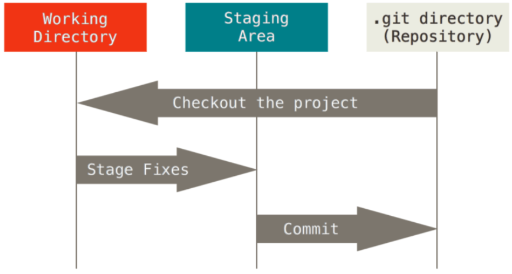
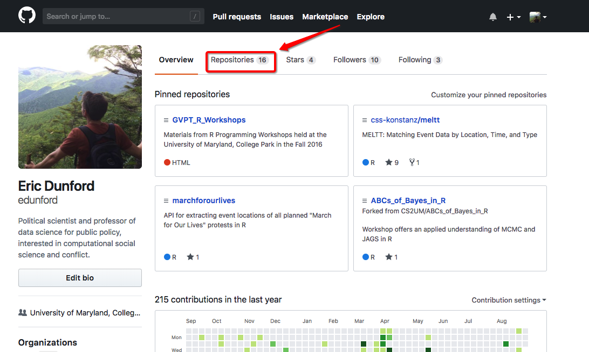
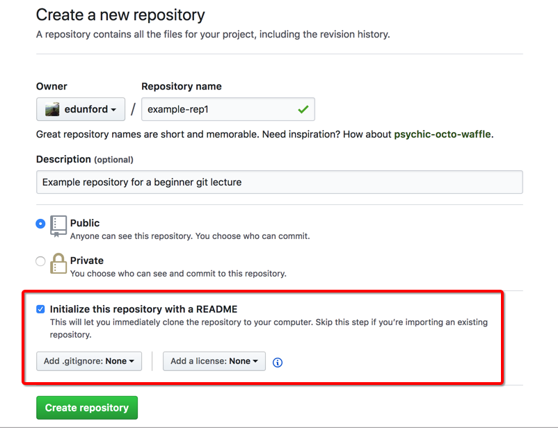
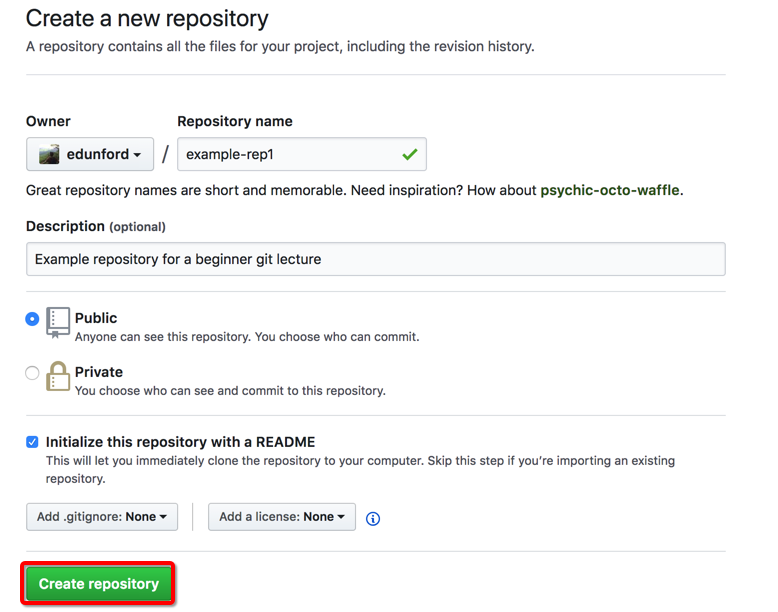
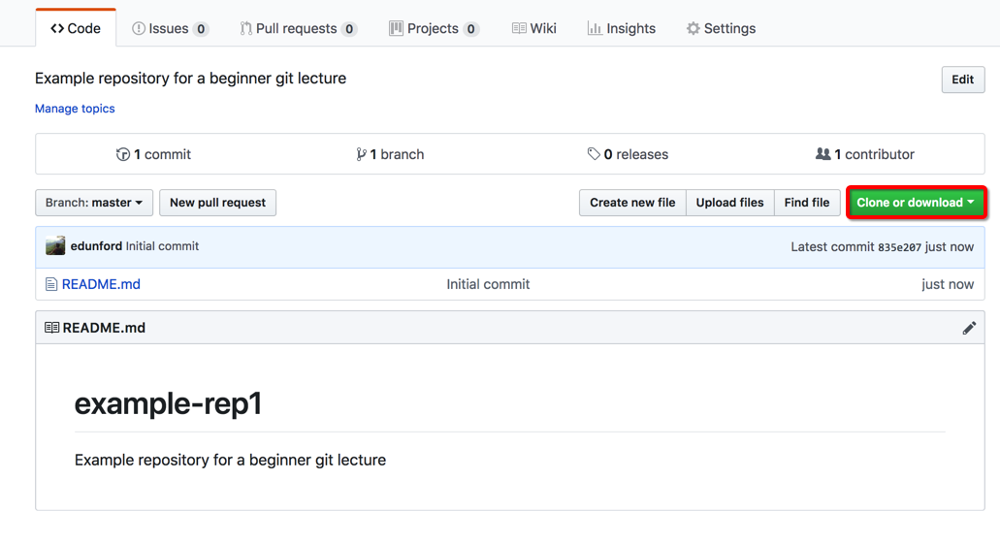
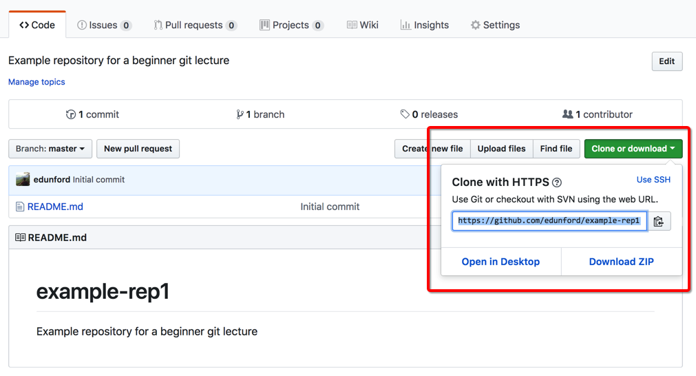

```{r setup, include=FALSE}
knitr::opts_chunk$set(echo = T,message=F,error=F,warning = F)
require(tidyverse)
require(here)
require(kableExtra)
```

layout: true

<div class="slide-footer"><span> 
PPOL564 | Data Science I - Foundations

&emsp;&emsp;&emsp;&emsp;&emsp;&emsp;&emsp;&emsp;&emsp;

Class 2 <!-- Week of the Footer Here -->

&emsp;&emsp;&emsp;&emsp;&emsp;&emsp;&emsp;&emsp;&emsp;&emsp;&emsp;&emsp;

Version Control <!-- Title of the lecture here -->

</span></div> 

---

class: outline

# Plan for Today


- **What version control and how it works**

- Operating it with **_command line arguments_**

- **_Basics of `git`_**

- Generating repositories on **_`Github`_**

- Linking local repositories with online **remotes**

- Dealing with **merge conflicts**

- **Branching**
    
    
---

class: newsection

# Git

---

## What is version control?

**Version control is a system that records changes to a file or set of files over time so that you can recall specific versions later.**

For many, "version-control" means something like this...

```
my-project
├── my-paper_v5.2.docx
├── Drafts/
    ├── my-paper_v5.1.docx
    ├── my-paper_v5.docx
    ├── my-paper_v4.7.docx
    ├── my-paper_v4.6.docx
    ├── my-paper_v4.5.docx
    ...
```

Version control in this manner is **error prone and complicates collaboration**

---

## What is `git`?

<br>
<br>

- `git` is one of many possible version control protocols (others include mercurial, bazaar, darc, ...)

- It is useful because it saves snapshots rather than just tracking differences. Treats **data as a stream of snapshots**.

- Changes are made **locally** and then can be easily incorporated and merged with the work of others. No network dependencies required.

- it’s impossible to change the contents of any file or directory without Git knowing about it.

---

## How `git` works...

Three states:

- **Committed** &rarr; data is safely stored in your local database.
- **Modified** &rarr; changed the file but have not committed it to the database yet.
- **Staged** &rarr; marked a modified file in its current version to go into the next commit snapshot.


.center[]

---

## Visualizing Initution of Git 

<br><br>
It helps to get a graphical understanding of what git is doing: 
<br><br>
.center[
[**Visualize Git**](http://git-school.github.io/visualizing-git/)
]

---

class: newsection

# Github

---
## What is Github?
<br>
<br>
<br>
- single largest host for Git repositories (i.e. the `.git` that the `git init` produces)

- can `push` our changes to the repository to upload our changes to the remote.

- Recall that a git repository is an **entire snapshot** of a project and all its data, so the fact that we can upload and download files, work on them locally, and then incorporate those changes back into the main work flow is quite powerful!

---

## Create a new `git` repository

First, **create an account at [Github.com](https://github.com/).** The proceeding steps will go through how to create a `git` repository through Github. 

Then, 

.center[]

---

## Create a new `git` repository

.center[]

---

## Create a new `git` repository

.center[]

---

## Create a new `git` repository

.center[]

---

## Create a new `git` repository

.center[]

---

## Create a new `git` repository

.center[]

---

## Create a new `git` repository

.center[]

---

## A Visual Intuition of Git 

<br><br>
It helps to get a graphical understanding of what git is doing: 
<br><br>
.center[
[**Visualize git tree with upstream remote changes**](http://git-school.github.io/visualizing-git/#upstream-changes)
]

